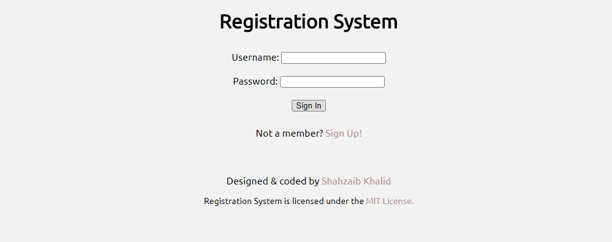
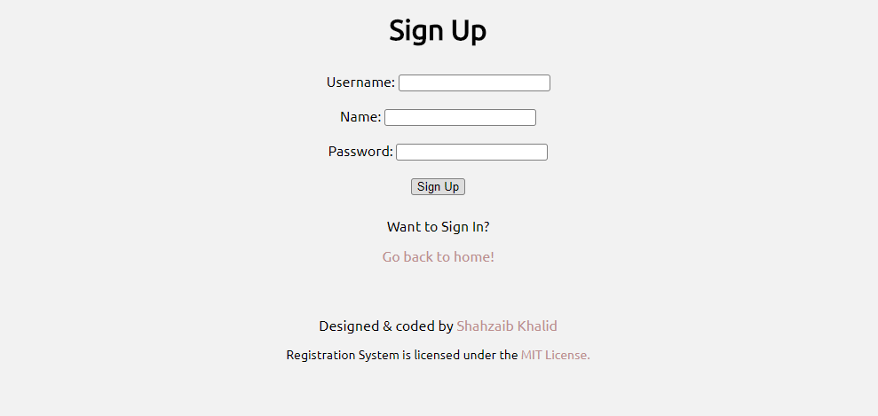

<h1 align="center">Registration System</h1>

A completely unopinionated MERN based user registration system, featuring sign-up, sign-in and remember password, built with zero-dependency.
 

## Detail
Registration System is a hobby project built purely using MERN (MongoDB, ExpressJS, ReactJS, NodeJS) stack and didn't rely on any package to implement Sign In, Sign Up and Remember Password functionality.

## Design
This is how the design looks like:
### Sign In

### Sign Up

## Use
You can use Registration System by clicking [here](https://shahzaibkhalid.github.io/registartion-system/)

## License
Productive Pomodoro Clock is licensed under the [MIT License](https://github.com/shahzaibkhalid/registartion-system/blob/master/LICENSE.txt).

Copyright (c) 2017 Shahzaib Khalid